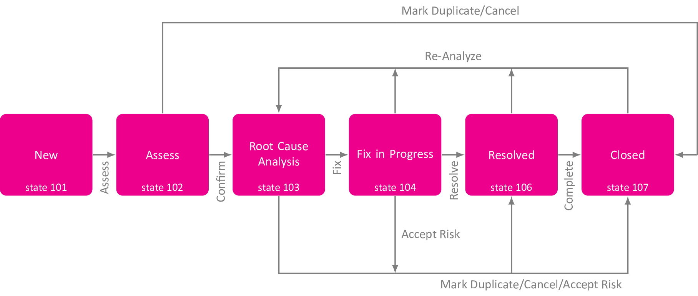
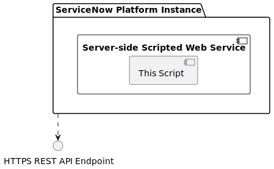

# Scoped Certified Application Design

## API for Red Hat Ansible Automation Platform Certified Content Collection

Author: Uroš Paščinski (uros.pascinski@xlab.si)

Document version: 0.1 (draft)

### Application Overview and Intended Use

ServiceNow Problem Management is one of the features of the ServiceNow Platform through which users can describe problems, such as hardware and software failures, and manage problem handling from its inception towards its resolution. It is a way to document that a problem has occurred, to assign responsible people to work on problem resolution, and to document causes, workarounds and fixes, or to eventually find out that with given resources a problem has no resolution.

Problems can be easily managed by using ServiceNow Platform. Prior to version Rome, clients relying upon ServiceNow REST API were also able to manage problems by using Table API. Starting with version Rome, ServiceNow Problem Management via REST API is no longer supported. Clients that had relied upon this feature, such as ServiceNow Ansible collection, can no longer properly manage problems in ServiceNow.

This scripted Web application has been developed to bring back the possibility of managing problems via REST APIs. In particular, it exposes a single endpoint intended for updating problem's state.

#### Third-party Dependencies

This application is a server-side REST script, which has no external dependencies. It relies upon scoped API resources only, such as `GlideRecord`.

### ServiceNow Problem Management

The ServiceNow Platform characterizes problem management with a set of states, actions and attributes, as described in more details in the following sections.

#### Problem States and Actions

 A problem is always in exactly one of the predefined states, which designates the status of a problem's resolution. Once a problem is created, its state becomes *new*. From that state the only possible action is *assess*, which transitions the problem to the *assessed* state. From there, a user can decide among several actions. A problem can be *confirmed*, which changes its state to *root cause analysis*. Other two possible actions are to either mark a problem as a duplicate of another problem or to cancel problem's resolution, both transitioning the problem into the *closed* state. During the *root cause analysis* phase, the problem is getting analyzed for possible resolutions. It might turn out that the problem is a duplicate of another problem or that it is not reasonable to continue with finding the solution, by either canceling the problem or accepting the risk of not dealing with it, leading problem to either the *resolved* or *closed* state. However, if a fix has been found, this advances the problem into the *fix in progress* state. While fixing a problem, additional analysis might be needed, transitioning it back to the *root cause analysis* state. By accepting the risk of not solving the problem it can lead it to either *resolved* or *closed* state. If the problem gets resolved, it is possible to re-analyze it again or mark it as complete, the later making its state *closed*. Once the problem is closed, it is still possible to analyze it again, especially if that state has been reached because the problem was cancelled, or if the accepted risk might not be acceptable anymore. All possible state transitions and the actions that cause the transitions are shown in the figure below.



#### Problem Attributes

To document how a particular state has been achieved, some state transitions are only possible if all the mandatory attributes are filled in. Upon creation of the problem, the bare minimum is to provide a short description of the problem. To transition problem state into a new state, the following table shows the set of mandatory fields and their values (when they apply) that should be provided depending on the state transition and action.

| From state            | To state             | Action            | Required fields |
| --------------------- | -------------------- | ----------------- | --------------- |
| New                   | Assess               | Assess            | assigned_to     |
| Assess                | Root Cause Analysis  | Confirm           |                 |
| Root Cause Analysis   | Fix in Progress      | Fix               | cause_notes, fix_notes |
| Fix in Progress       | Resolved             | Resolve           | resolution_code = fix_applied |
| Resolved              | Closed               | Complete          |                 |
| Closed                | Root Cause Analysis  | Re-analyze        |                 |
| Root Cause Analysis   | Closed               | Duplicate         | resolution_code = duplicate, duplicate_of |
| Root Cause Analysis   | Closed               | Accept Risk       | resolution_code = risk_accepted, cause_notes, close_notes |
| Root Cause Analysis   | Closed               | Cancel            | resolution_code = canceled, close_notes |

### Software Architecture Overview

All the code runs on the ServiceNow Platform instance.



### Software Design Description: REST Web Application

The problem state transition service is developed as a scripted REST Web application that integrates into the ServiceNow platform as an endpoint. It relies upon scoped `GlideRecord` to obtain the information about a problem, such as its state and other attributes, and to update the attributes according to the data provided in a request.

#### Exposed Endpoint

The problem state transition service only supports update operations on already existing problem. Therefore, it is sufficient to expose only one endpoint. The endpoint accepts HTTP PATCH method, which is semantically relevant when updating records. Every request towards the endpoint should return exactly one problem record or an error message.

#### Input Parameters

The problem state transition service accepts several input parameters, which are provided as path, query or body parameters. Some of the parameters are mandatory, others are optional.

##### Path Parameters

The endpoint is of form `/api/x_733499_ansible/ansible_problem/{problem_number}/new_state/{new_state}`. Path accepts two mandatory parameters:

- `problem_number`, for example, `PRB0040018`, is a string that uniquely determines a problem record; and
- `new_state`, for example, `104`, which is an integer representing a state the problem should be transitioned to.

##### Query Parameters

The endpoint accepts optional query parameters, which are among the standard ServiceNow REST API query parameters and control the output of the resulting record, as follows:

- `sysparm_display_value` parameter is a string with possible values `true`, `false` and `all`. The default value is `false`. If set to `true`, the `GlideRecord` for the corresponding problem outputs the display values of fields. Instead, if set to `false`, the corresponding values are returned. If set to `all`, both the display value and the value of each output field are provided.
- `sysparm_fields` parameter is a comma separated list of field names, encoded as a string, that control which problem's fields should be returned in the response. If empty, all the problem's fields are returned. It may contain invalid field names, which are silently ignored.
- `sysparm_exclude_reference_link` parameter is of a Boolean type and controls if the response record should contain explicit links for fields that link to another Glide record. The default value is `false`, meaning that the links are shown.

##### Body Parameters

The endpoint accepts body parameters. Depending on problem's current and target state (i.e., new state), some body parameters are mandatory, while in general, body parameters are optional. They are supplied in a JSON format, where keys designate corresponding problem's field names and the value provides the corresponding problem's field values. See section *Problem Attributes* for the description of mandatory fields depending on the state transitions.

#### Problem State Transition Logic

The application's flow can be logically separated into three consecutive phases: extracting and validating input parameters, updating problem's fields, and forming the response body. Each phase is described in the following.

##### Extracting and Validating Input Parameters

During this phase, all the path and body parameters are extracted and validated. The validation follows the same logic as described in section *ServiceNow Problem Management*. Input parameters are considered valid if applying them to the existing problem record would transition the corresponding problem into the given new state. In more details, a valid input provides a valid new state and a problem number that points to an existing problem record. The new state has to be achievable from the problem's current state. Moreover, all the mandatory fields that apply to the transition from the current to the new state need to be provided (as body parameters). The values of certain fields are verified, because they can only contain certain values (i.e., the corresponding type is enum not a free-form text). What particular value is accepted can depend on the state transition. An example of such parameter is `resolution_code`, which can be seen as a name of the action that transitions current state into a new state. The problem state transitions diagram in section *Problem State and Actions* shows that some state transitions can start and end in the same pair of states. In this case the `resolution_code` is one single attribute that distinguishes between such transitions.

The `update` method of `GlideRecord` internally performs some validation whether the state transitions are valid and whether they contain all the mandatory fields. However, we found out that the validation is not as thorough as it is when managing problem via ServiceNow Platform user interface. For example, when marking a problem as a duplicate of another problem, it is possible to point to the same problem. In addition to that, the error messages obtained from `getLastErrorMessage` of the `GlideRecord` when the `update` method returns false are somewhat too generic and therefore to the users do not provide the satisfactory level of insight about why the error occurred.

##### Updating Problem Fields

Once all the path and body input parameters have been extracted and validated, and if that has not resulted in an error, all the provided fields that are valid for the problem record schema are updated. Individually, the field values are set with the `setValue` method of `GlideRecord`. To get the fields actually written to the corresponding problem table record, the `update` method is called. This method also performs validation. If it returns `false`, the error obtained from the `getLastErrorMessage` method is returned in the response. If it returns `true`, the program flow advances to the next phase, i.e., building the response.

##### Building Response

In the response the updated record is returned. Optional query parameters control how the output record is built and mimic the behavior of how these parameters work in standard REST Table APIs. However, only three output parameters are defined out of seven.

The resulting record contains only the fields that are specified in parameter `sysparm_fields` and that exist in the problem record schema. If this parameter is empty or omitted from the input, all record fields are returned.

Fields that reference another record have a dedicated parameter `sysparm_exclude_reference_link`, which controls whether references should be shown in the resulting record or not. A reference is a URL pointing to the record. Each output field is checked if it is a reference or not. For reference fields, besides its value and/or display value the link key is provided, with a value set to the URL pointing to the record in the referenced table.

Record field values can have two representations. Besides the value a field can also have display value that may differ from its value. For each field in a record, either values, display values or both can be returned. This behavior is controlled by the parameter `sysparm_display_value`.

#### Response

The execution of the program flow can end with a state being transitioned to a new state or with an error. All responses return a JSON object.

In case of an error, no field value of the target record should be updated. Standard error response objects are used for errors, such as `sn_ws_err.BadRequestError` and `sn_ws_err.ConflictError`. The corresponding error JSON object has the following structure:

```JSON
{
  "error": {
    "detail": "Error detail",
    "message": "Some error message"
  },
  "status": "failure"
}
```

If no error occurs during the execution of the script, the updated record is returned. An example result record with `sysparm_display_value=false` and `sysparm_exclude_reference_link=false`:

```JSON
{
  "result": {
    "first_reported_by_task": "",
    "parent": "",
    "made_sla": "true",
    "watch_list": "",
    "fix_communicated_by": "",
    "upon_reject": "cancel",
    "sys_updated_on": "2022-07-20 09:37:34",
    "cause_notes": "<p>Added cause notes</p>",
    "task_effective_number": "PRB0040018",
    "approval_history": "",
    "fix_at": "2022-07-20 09:35:01",
    "number": "PRB0040018",
    "resolved_by": {
    "link": "https://dev72830.service-now.com/api/now/table/sys_user/6816f79cc0a8016401c5a33be04be441",
    "value": "6816f79cc0a8016401c5a33be04be441"
    },
    "sys_updated_by": "admin",
    "opened_by": {
    "link": "https://dev72830.service-now.com/api/now/table/sys_user/6816f79cc0a8016401c5a33be04be441",
    "value": "6816f79cc0a8016401c5a33be04be441"
    },
    "user_input": "",
    "sys_created_on": "2022-07-09 05:41:40",
    "sys_domain": {
    "link": "https://dev72830.service-now.com/api/now/table/sys_user_group/global",
    "value": "global"
    },
    "state": "107",
    "route_reason": "",
    "sys_created_by": "admin",
    "knowledge": "false",
    "order": "",
    "major_problem": "false",
    "closed_at": "2022-07-20 09:37:34",
    "cmdb_ci": "",
    "delivery_plan": "",
    "contract": "",
    "impact": "3",
    "active": "false",
    "work_notes_list": "",
    "business_service": "",
    "priority": "5",
    "sys_domain_path": "/",
    "rfc": "",
    "time_worked": "",
    "expected_start": "",
    "opened_at": "2022-07-09 05:41:40",
    "business_duration": "1970-01-03 08:00:00",
    "group_list": "",
    "work_end": "",
    "resolved_at": "2022-07-20 09:36:50",
    "approval_set": "",
    "subcategory": "",
    "work_notes": "",
    "reopened_at": "2022-07-20 09:34:16",
    "universal_request": "",
    "short_description": "A problem",
    "correlation_display": "",
    "delivery_task": "",
    "work_start": "",
    "assignment_group": "",
    "known_error": "false",
    "additional_assignee_list": "",
    "description": "",
    "calendar_duration": "1970-01-12 03:55:54",
    "fix_by": {
    "link": "https://dev72830.service-now.com/api/now/table/sys_user/6816f79cc0a8016401c5a33be04be441",
    "value": "6816f79cc0a8016401c5a33be04be441"
    },
    "close_notes": "",
    "service_offering": "",
    "sys_class_name": "problem",
    "closed_by": {
    "link": "https://dev72830.service-now.com/api/now/table/sys_user/6816f79cc0a8016401c5a33be04be441",
    "value": "6816f79cc0a8016401c5a33be04be441"
    },
    "follow_up": "",
    "workaround": "<p>Workaround description</p>",
    "sys_id": "4ba6a28e87a05110f4c365f73cbb354e",
    "contact_type": "",
    "reopened_by": {
    "link": "https://dev72830.service-now.com/api/now/table/sys_user/6816f79cc0a8016401c5a33be04be441",
    "value": "6816f79cc0a8016401c5a33be04be441"
    },
    "resolution_code": "duplicate",
    "urgency": "3",
    "company": "",
    "reassignment_count": "0",
    "confirmed_at": "2022-07-13 13:01:55",
    "related_incidents": "0",
    "activity_due": "",
    "assigned_to": {
    "link": "https://dev72830.service-now.com/api/now/table/sys_user/d3dbbf173b331300ad3cc9bb34efc466",
    "value": "d3dbbf173b331300ad3cc9bb34efc466"
    },
    "workaround_communicated_by": "",
    "review_outcome": "",
    "comments": "",
    "fix_communicated_at": "",
    "approval": "not requested",
    "sla_due": "",
    "comments_and_work_notes": "",
    "due_date": "",
    "problem_state": "107",
    "sys_mod_count": "66",
    "reopen_count": "17",
    "duplicate_of": {
    "link": "https://dev72830.service-now.com/api/now/table/problem/PRB0040019",
    "value": "PRB0040019"
    },
    "sys_tags": "",
    "escalation": "0",
    "upon_approval": "proceed",
    "confirmed_by": {
    "link": "https://dev72830.service-now.com/api/now/table/sys_user/6816f79cc0a8016401c5a33be04be441",
    "value": "6816f79cc0a8016401c5a33be04be441"
    },
    "correlation_id": "",
    "location": "",
    "workaround_communicated_at": "",
    "category": "",
    "fix_notes": "<p>Added fix notes</p>",
    "workaround_applied": "true"
  }
}
```

### Performance Considerations and Concerns

The server-side script does not have any particular performance concerns. The problem record is searched for in the `GlideRecord` by problem `number`. When `sysparm_exclude_reference_link` is set to `false`, the record's fields that should go to the output, however, are expanded to `GlideElement`, which requires additional queries in a database. This is required to determine which field is a reference. If `resolution_code` is set to `duplicate` and `duplicate_of` field is provided in the request body, the `GlideRecord` is searched for the `sys_id` specified as a value in `duplicate_of` field to check if the problem exists and if it does not point to the same problem.

### Security Considerations and Concerns

The exposed REST API endpoint is protected by ServiceNow Platform authentication and authorization. To authenticate a user, any available authentication method of ServiceNow can be used, such as LDAP and OAuth2.

To authorize a user, the default ACLs for REST API endpoints are required. No additional roles have been defined.

It is recommended to create a dedicated user who is granted only the minimum set of roles and then use that user for authenticating and authorizing clients performing HTTP requests.
